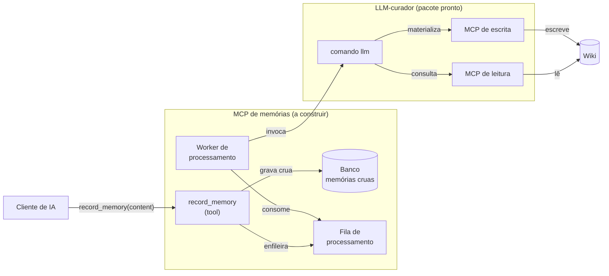
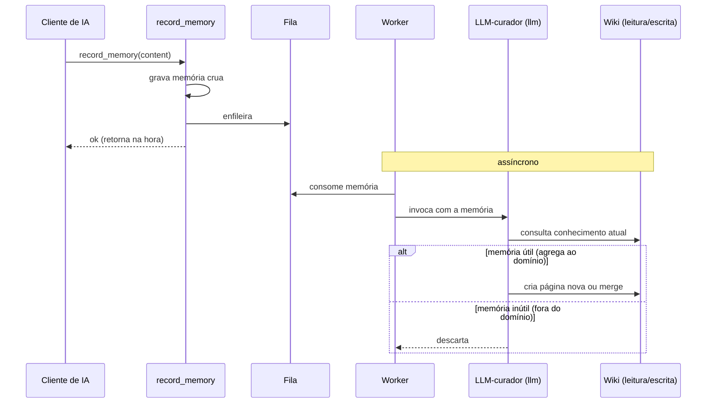

# Escopo do Projeto — MCP de LLM Wiki baseado em memórias

## Visão geral

Construir um **MCP (Model Context Protocol)** que transforma o conhecimento gerado durante a interação com agentes de IA em uma **wiki** consultável. O sistema tem dois passos:

1. **Coleta** — durante a interação, o modelo reconhece informação digna de memória e a envia ao MCP.
2. **Processamento** — o MCP decide se a memória é relevante e, em caso positivo, a incorpora à wiki.

A relevância é julgada **em relação ao conhecimento que já existe na wiki**: uma memória só é útil se agrega ao corpo de conhecimento atual.

## Objetivo final

A entrega funciona quando é possível: subir o ambiente com um único `docker compose up`, registrar o MCP em um cliente de IA e executar prompts que exercitem a coleta e o processamento — sem passos manuais extras.

O MCP de memórias deve ser servido em `http://localhost:9000/mcp-memory`.

O comando `llm` e os MCPs da wiki respondem em `localhost` do host. Por isso, os serviços no `docker compose` devem usar **`network_mode: host`**, para alcançá-los diretamente por `localhost`.

## Stack

- **TypeScript**, usando o cliente Node do `@modelcontextprotocol`.
- **Banco de dados** (SQLite, Postgres ou equivalente) para armazenar as memórias.

## Fronteira: o que é dado vs. o que se constrói

**Dado pronto:**

- **Imagem base `node-llm`** — uma imagem Docker já disponível no ambiente local, para servir de base ao MCP de memórias. Detalhes:
  - Traz **Node 22** pronto para rodar a aplicação.
  - Traz um **comando `llm`** que envia um prompt ao LLM-curador. O prompt é passado como argumento:

    ```bash
    llm "prompt a ser executado"
    ```

  - O LLM-curador já vem **configurado com os MCPs de leitura e escrita da wiki**; o comando `llm` é a porta de entrada para ele.

**A construir:**

- O **MCP de memórias**, que coleta e persiste as memórias.
- Um **worker** que processa as memórias.

## Arquitetura

### Componentes



### Sequência



## Passo 1 — Coleta (ativação)

O MCP expõe uma tool de registro de memória (`record_memory`) com um único parâmetro: `content` (string) — o texto da memória, autocontido. A descrição da tool instrui o modelo a chamá-la sempre que surgir informação **durável** e a permanecer em silêncio para conteúdo **efêmero**.

Registrar quando surgir:

1. **Problema resolvido** — um problema foi diagnosticado e solucionado.
2. **Achado** — algo relevante foi descoberto durante o desenvolvimento.
3. **Implementação** — algo novo foi construído ou uma parte importante mudou.
4. **Decisão técnica** — uma escolha foi feita entre alternativas; registrar o quê e por quê.
5. **Convenção ou preferência** — um padrão, estilo ou preferência foi estabelecido.
6. **Restrição** — um limite ou requisito que passa a condicionar as soluções.
7. **Armadilha** — uma abordagem que não funciona; registrar o que evitar e por quê.
8. **Correção de entendimento** — algo antes tido como verdadeiro se mostrou falso.

A memória coletada é armazenada no banco de dados **crua** e **enfileirada** para processamento. A tool retorna imediatamente, sem esperar o curador — a coleta não deve bloquear o cliente.

## Passo 2 — Processamento (útil vs inútil)

O processamento é **assíncrono, orientado a fila**: um worker consome as memórias enfileiradas e roda o curador para cada uma, de forma independente da coleta.

O comportamento do curador é definido pelo prompt que ele recebe. O resultado esperado é:

- Uma memória que **agrega** ao conhecimento existente é escrita na wiki.
- Uma memória que **não agrega** não gera escrita.

A relevância é **relativa ao domínio da wiki**, não apenas à qualidade intrínseca da memória: uma memória bem-formada mas fora do domínio não deve ser escrita.

A wiki é a **"Wiki do Maico"** — o conhecimento pessoal do Maico sobre seus projetos e ferramentas. Esse enquadramento importa: o prompt do curador deve situar a decisão em torno do que é relevante para o Maico e seus projetos, não de relevância genérica.

Exemplo (ilustrativo, não prescritivo) da ideia do prompt:

```
Você é o curador da "Wiki do Maico". Avalie a memória a seguir e, se ela for
relevante para o Maico e seus projetos, incorpore-a à wiki; caso contrário,
ignore-a.

Memória: "<conteúdo>"
```

## Critérios de aceitação

1. **Sobe com `docker compose`** — o ambiente inteiro (MCP de memórias, banco, curador) levanta com um comando.
2. **Registrável como MCP** — um cliente de IA consegue registrar e conectar ao MCP de memórias em `http://localhost:9000/mcp-memory`.
3. **Expõe `record_memory(content)`** — a tool aparece com o parâmetro `content` e descrição que orienta durável vs. efêmero.
4. **Ativação seletiva** — chama a tool para conteúdo durável e permanece em silêncio para conteúdo efêmero.
5. **Persiste memória crua** — a memória recebida é gravada no banco antes do processamento.
6. **Dispara o curador** — o processamento invoca o comando `llm` passando a memória.
7. **Guarda memória útil** — memória dentro do domínio da wiki é materializada (página nova ou merge) via curador.
8. **Descarta memória inútil** — memória fora do domínio não vira conteúdo na wiki.
9. **Relevância relativa ao domínio** — a decisão considera o que já existe na wiki, não apenas a qualidade intrínseca da memória.


